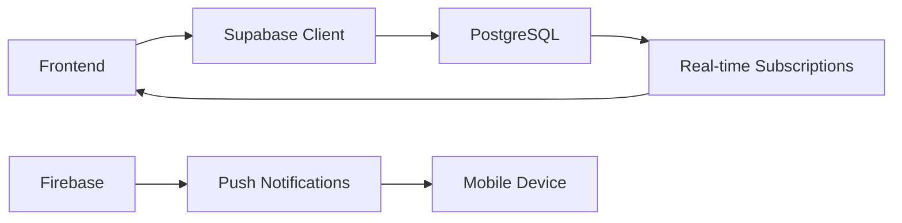
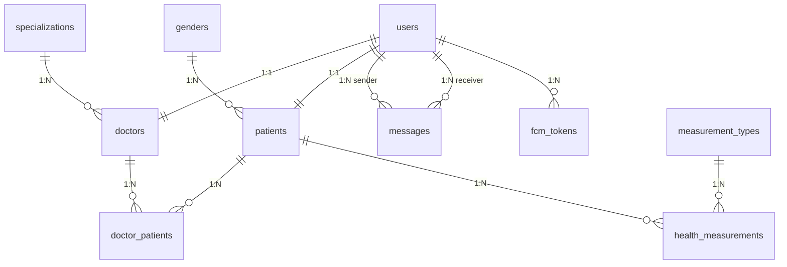

# 🏥 HealthTracker-Doctors

**Doktorlar için Kapsamlı Sağlık Takip Sistemi**

HealthTracker-Doctors, doktorların hastalarını etkin bir şekilde takip edebilmesi, sağlık verilerini izleyebilmesi ve hastalarıyla anlık iletişim kurabilmesi için geliştirilmiş modern bir mobil uygulamadır.

[](https://reactnative.dev/)
[](https://expo.dev/)
[](https://www.typescriptlang.org/)
[](https://supabase.com/)
[](https://firebase.google.com/)

---

## 📋 İçindekiler

- [🎯 Özellikler](#-özellikler)
- [🛠️ Teknoloji Stack](#️-teknoloji-stack)
- [📦 Kurulum](#-kurulum)
- [🔧 Yapılandırma](#-yapılandırma)
- [🏗️ Mimari](#️-mimari)
- [📚 API Dokümantasyonu](#-api-dokümantasyonu)
- [🗄️ Veritabanı Şeması](#️-veritabanı-şeması)
- [🚀 Geliştirme](#-geliştirme)
- [📱 Deployment](#-deployment)
- [🤝 Katkıda Bulunma](#-katkıda-bulunma)
- [📄 Lisans](#-lisans)

---

## 🎯 Özellikler

### 👨‍⚕️ Doktor Yönetimi
- **Kimlik Doğrulama**: Güvenli giriş/çıkış sistemi
- **Profil Yönetimi**: Doktor bilgileri ve uzmanlık alanı
- **Dashboard**: Okunmamış mesajlar ve hasta özeti

### 👥 Hasta Yönetimi
- **Hasta Listesi**: Tüm hastaları görüntüleme ve arama
- **Hasta Detayları**: Kişisel bilgiler ve tıbbi geçmiş
- **Hasta Ekleme**: Yeni hasta kaydı oluşturma
- **Hasta Notları**: Doktor notları ve hasta özellikleri

### 📊 Sağlık Verileri Takibi
- **Ölçüm Geçmişi**: Kan şekeri, tansiyon, vücut ağırlığı vb.
- **Grafik Görselleştirme**: Trend analizi ve zaman serisi
- **Ölçüm Türleri**: Farklı sağlık parametreleri
- **Manuel Veri Girişi**: Doktor tarafından veri ekleme

### 💬 Anlık İletişim
- **Gerçek Zamanlı Mesajlaşma**: Hasta-doktor iletişimi
- **Mesaj Durumu**: Okundu/okunmadı takibi
- **Push Bildirimleri**: FCM ile anlık bildirimler
- **Mesaj Geçmişi**: Tüm konuşma geçmişi

### 🔔 Bildirim Sistemi
- **FCM Integration**: Firebase Cloud Messaging
- **Token Yönetimi**: Cihaz token'larının otomatik güncellenmesi
- **Platform Desteği**: Android ve iOS uyumluluğu
- **Bildirim Türleri**: Mesaj, hatırlatma, bilgi bildirimleri

---

## 🛠️ Teknoloji Stack

### Frontend Framework
- **React Native 0.79.2** - Cross-platform mobil uygulama geliştirme
- **Expo 53.0.9** - React Native geliştirme platformu
- **TypeScript 5.8.3** - Tip güvenliği ve gelişmiş IDE desteği
- **Expo Router 5.0.3** - Dosya tabanlı routing sistemi

### State Management
- **Zustand 4.5.1** - Hafif ve performanslı state yönetimi
- **Store Pattern** - Modüler store yapısı (auth, profile, patients, messages)

### Backend & Database
- **Supabase** - PostgreSQL veritabanı ve backend servisleri
- **Real-time Subscriptions** - Anlık veri güncellemeleri
- **Row Level Security (RLS)** - Güvenlik politikaları
- **Auto-generated TypeScript Types** - Tip güvenliği

### Authentication & Security
- **Supabase Auth** - Kullanıcı kimlik doğrulama
- **JWT Tokens** - Güvenli session yönetimi
- **AsyncStorage** - Local data persistence
- **Secure Store** - Hassas verilerin güvenli saklanması

### Push Notifications
- **Firebase Cloud Messaging (FCM)** - Cross-platform push notifications
- **React Native Firebase** - Native Firebase integration
- **Token Management** - Automatic token refresh and synchronization

### UI & Styling
- **React Native Components** - Native UI bileşenleri
- **Expo Vector Icons** - Zengin icon kütüphanesi
- **Safe Area Context** - Güvenli alan yönetimi
- **Custom Components** - Yeniden kullanılabilir UI bileşenleri

### Development Tools
- **ESLint** - Code linting ve stil kontrolü
- **Prettier** - Code formatting
- **TypeScript** - Static type checking
- **Metro Bundler** - JavaScript bundling

---

## 📦 Kurulum

### Ön Gereksinimler

```bash
# Node.js (v18 veya üzeri)
node --version

# npm veya yarn
npm --version

# Expo CLI
npm install -g @expo/cli

# React Native geliştirme ortamı (Android/iOS)
```

### 1. Proje Klonlama

```powershell
git clone <repository-url>
cd HealthTracker-Doctors
```

### 2. Bağımlılıkları Yükleme

```powershell
npm install
```

### 3. Ortam Değişkenlerini Ayarlama

`.env` dosyasını oluşturun ve gerekli değerleri girin:

```env
# Supabase Configuration
EXPO_PUBLIC_SUPABASE_URL=your_supabase_url
EXPO_PUBLIC_SUPABASE_ANON_KEY=your_supabase_anon_key

# Development User (İsteğe bağlı)
EXPO_PUBLIC_DEV_USER_EMAIL=doctor@example.com
EXPO_PUBLIC_DEV_USER_PASSWORD=your_password
```

### 4. Firebase Yapılandırması

**Android:**
- `google-services.json` dosyasını `android/app/` klasörüne yerleştirin

**iOS:**
- `GoogleService-Info.plist` dosyasını proje root'una yerleştirin

### 5. Uygulamayı Çalıştırma

```powershell
# Development server başlatma
npm start

# Android emulator/device
npm run android

# iOS simulator (macOS gerekli)
npm run ios

# Web browser
npm run web
```

---

## 🔧 Yapılandırma

### Supabase Yapılandırması

1. **Supabase Projesi Oluşturun**
2. **Veritabanı şemasını import edin** (SQL dosyaları docs/ klasöründe)
3. **Row Level Security (RLS) politikalarını aktifleştirin**
4. **API anahtarlarını .env dosyasına ekleyin**

### Firebase Yapılandırması

1. **Firebase Console'da proje oluşturun**
2. **Android/iOS app'lerini registrate edin**
3. **Cloud Messaging'i aktifleştirin**
4. **Konfigürasyon dosyalarını indirin ve yerleştirin**

### Geliştirme Kullanıcısı

Hızlı test için development kullanıcısı tanımlanabilir:

```typescript
// lib/supabase.ts
export const DEV_USER = {
  email: 'doctor@example.com',
  password: 'password123',
};
```

---

## 🏗️ Mimari

### Proje Yapısı

```
HealthTracker-Doctors/
├── app/                    # Expo Router sayfaları
│   ├── (auth)/            # Kimlik doğrulama sayfaları
│   ├── (tabs)/            # Tab navigation sayfaları
│   ├── patient/           # Hasta detay sayfaları
│   └── ...
├── components/            # Yeniden kullanılabilir UI bileşenleri
├── lib/                   # Utility fonksiyonları ve konfigürasyon
│   ├── hooks/             # Custom React hooks
│   └── types/             # TypeScript tip tanımları
├── services/              # API servisleri ve business logic
├── store/                 # Zustand state stores
├── assets/                # Resim ve diğer static dosyalar
└── docs/                  # Dokümantasyon dosyaları
```

### State Management Mimarisi

```typescript
// Zustand Store Pattern
interface AuthStore {
  session: Session | null;
  user: User | null;
  isInitialized: boolean;
  signIn: (email: string, password: string) => Promise<void>;
  signOut: () => Promise<void>;
  initialize: () => Promise<void>;
}
```

**Ana Store'lar:**
- `authStore` - Kimlik doğrulama durumu
- `profileStore` - Doktor profil bilgileri
- `patientsStore` - Hasta listesi ve filtreleme
- `messagesStore` - Mesajlaşma verileri

### Servis Katmanı

```typescript
// Service Pattern
class DoctorService {
  async getDoctorProfile(userId: string): Promise<DoctorProfile | null>
  async getDoctorPatients(doctorId: string): Promise<Patient[]>
  async addPatientToDoctor(doctorId: string, patientData: PatientData): Promise<void>
}
```

**Ana Servisler:**
- `authService` - Kimlik doğrulama işlemleri
- `doctorService` - Doktor ve hasta yönetimi
- `messagesService` - Mesajlaşma işlemleri
- `patientDetailService` - Hasta detayları ve ölçümler
- `fcmTokenService` - Push notification token yönetimi

### Real-time Data Flow



---

## 📚 API Dokümantasyonu

### Authentication API

#### Giriş Yapma
```typescript
const { data, error } = await supabase.auth.signInWithPassword({
  email: 'doctor@example.com',
  password: 'password123'
});
```

#### Çıkış Yapma
```typescript
const { error } = await supabase.auth.signOut();
```

#### Session Durumu
```typescript
const { data: { session } } = await supabase.auth.getSession();
```

### Doctor API

#### Doktor Profili Getirme
```typescript
const profile = await doctorService.getDoctorProfile(userId);
```

#### Doktor Hastalarını Listeleme
```typescript
const patients = await doctorService.getDoctorPatients(doctorId);
```

#### Yeni Hasta Ekleme
```typescript
await doctorService.addPatientToDoctor(doctorId, {
  name: 'Hasta Adı',
  surname: 'Hasta Soyadı',
  email: 'hasta@example.com',
  birthDate: '1990-01-01',
  genderId: 1
});
```

### Messages API

#### Mesajları Getirme
```typescript
const messages = await messagesService.getMessagesBetweenUsers(
  doctorUserId,
  patientUserId
);
```

#### Mesaj Gönderme
```typescript
await messagesService.sendMessage({
  content: 'Mesaj içeriği',
  senderUserId: doctorUserId,
  receiverUserId: patientUserId,
  messageTypeId: 1
});
```

#### Mesajları Okundu Olarak İşaretleme
```typescript
await messagesService.markMessagesAsRead(
  doctorUserId,
  patientUserId
);
```

### Health Measurements API

#### Hasta Ölçümleri
```typescript
const measurements = await patientDetailService.getPatientMeasurements(
  patientId,
  measurementTypeId
);
```

#### Ölçüm Geçmişi
```typescript
const history = await patientDetailService.getMeasurementHistory(
  patientId,
  measurementTypeId,
  limit
);
```

### FCM Token API

#### Token Kaydetme
```typescript
await fcmTokenService.saveToken({
  userId: userId,
  token: fcmToken,
  platform: Platform.OS,
  deviceInfo: deviceInfo
});
```

#### Token Güncelleme
```typescript
await fcmTokenService.updateToken(userId, newToken);
```

---

## 🗄️ Veritabanı Şeması

### Ana Tablolar

#### 1. users
```sql
CREATE TABLE users (
  id UUID PRIMARY KEY DEFAULT gen_random_uuid(),
  email TEXT UNIQUE NOT NULL,
  role_id INTEGER REFERENCES user_roles(id),
  created_at TIMESTAMP DEFAULT NOW(),
  updated_at TIMESTAMP DEFAULT NOW(),
  is_deleted BOOLEAN DEFAULT FALSE
);
```

#### 2. doctors
```sql
CREATE TABLE doctors (
  id UUID PRIMARY KEY DEFAULT gen_random_uuid(),
  user_id UUID REFERENCES users(id),
  name TEXT,
  surname TEXT,
  specialization_id INTEGER REFERENCES specializations(id),
  patient_count INTEGER DEFAULT 0,
  created_at TIMESTAMP DEFAULT NOW(),
  updated_at TIMESTAMP DEFAULT NOW(),
  is_deleted BOOLEAN DEFAULT FALSE
);
```

#### 3. patients
```sql
CREATE TABLE patients (
  id UUID PRIMARY KEY DEFAULT gen_random_uuid(),
  user_id UUID REFERENCES users(id),
  name TEXT,
  surname TEXT,
  birth_date DATE,
  gender_id INTEGER REFERENCES genders(id),
  patient_note TEXT,
  created_at TIMESTAMP DEFAULT NOW(),
  updated_at TIMESTAMP DEFAULT NOW(),
  is_deleted BOOLEAN DEFAULT FALSE
);
```

#### 4. doctor_patients
```sql
CREATE TABLE doctor_patients (
  id UUID PRIMARY KEY DEFAULT gen_random_uuid(),
  doctor_id UUID REFERENCES doctors(id),
  patient_id UUID REFERENCES patients(id),
  note TEXT,
  created_at TIMESTAMP DEFAULT NOW(),
  updated_at TIMESTAMP DEFAULT NOW(),
  is_deleted BOOLEAN DEFAULT FALSE
);
```

#### 5. messages
```sql
CREATE TABLE messages (
  id UUID PRIMARY KEY DEFAULT gen_random_uuid(),
  sender_user_id UUID REFERENCES users(id),
  receiver_user_id UUID REFERENCES users(id),
  content TEXT,
  message_type_id INTEGER REFERENCES message_types(id),
  is_read BOOLEAN DEFAULT FALSE,
  created_at TIMESTAMP DEFAULT NOW(),
  updated_at TIMESTAMP DEFAULT NOW(),
  is_deleted BOOLEAN DEFAULT FALSE
);
```

#### 6. health_measurements
```sql
CREATE TABLE health_measurements (
  id UUID PRIMARY KEY DEFAULT gen_random_uuid(),
  patient_id UUID REFERENCES patients(id),
  measurement_type_id INTEGER REFERENCES measurement_types(id),
  value DECIMAL,
  measured_at TIMESTAMP,
  method TEXT,
  created_at TIMESTAMP DEFAULT NOW(),
  updated_at TIMESTAMP DEFAULT NOW(),
  is_deleted BOOLEAN DEFAULT FALSE
);
```

#### 7. fcm_tokens
```sql
CREATE TABLE fcm_tokens (
  id UUID PRIMARY KEY DEFAULT gen_random_uuid(),
  user_id UUID REFERENCES users(id),
  token TEXT NOT NULL,
  platform TEXT,
  device_info TEXT,
  is_active BOOLEAN DEFAULT TRUE,
  created_at TIMESTAMP DEFAULT NOW(),
  updated_at TIMESTAMP DEFAULT NOW()
);
```

### Lookup Tablolar

- `user_roles` - Kullanıcı rolleri (patient, doctor, admin)
- `genders` - Cinsiyet kodları
- `specializations` - Doktor uzmanlık alanları
- `measurement_types` - Ölçüm türleri (kan şekeri, tansiyon, vb.)
- `message_types` - Mesaj türleri

### Database İlişkileri



---

## 🚀 Geliştirme

### Development Workflow

1. **Feature Branch Oluşturma**
   ```powershell
   git checkout -b feature/yeni-ozellik
   ```

2. **Kod Geliştirme**
   ```powershell
   # Development server
   npm start
   
   # Lint kontrolü
   npm run lint
   
   # Format kontrolü
   npm run format
   ```

3. **Test Etme**
   ```powershell
   # Android
   npm run android
   
   # iOS
   npm run ios
   ```

4. **Commit ve Push**
   ```powershell
   git add .
   git commit -m "feat: yeni özellik eklendi"
   git push origin feature/yeni-ozellik
   ```

### Code Style Guidelines

#### TypeScript Conventions
```typescript
// Interface naming
interface PatientData {
  id: string;
  name: string;
  surname: string;
}

// Function naming (camelCase)
const getPatientById = async (id: string): Promise<Patient | null> => {
  // Implementation
};

// Component naming (PascalCase)
const PatientCard: React.FC<PatientCardProps> = ({ patient }) => {
  // Implementation
};
```

#### File Naming Conventions
- **Components**: `PascalCase.tsx` (PatientCard.tsx)
- **Services**: `camelCase.ts` (doctorService.ts)
- **Stores**: `camelCase.ts` (authStore.ts)
- **Types**: `camelCase.ts` (database.ts)
- **Hooks**: `camelCase.ts` (useFCMToken.ts)

#### Folder Structure Best Practices
```
components/
├── common/           # Genel bileşenler
├── forms/            # Form bileşenleri
├── navigation/       # Navigation bileşenleri
└── patient/          # Hasta ile ilgili bileşenler

services/
├── api/              # API servisleri
├── auth/             # Authentication servisleri
└── storage/          # Storage servisleri
```

### Environment Setup

#### VS Code Extensions
- React Native Tools
- TypeScript and JavaScript Language Features
- ESLint
- Prettier
- React Native Snippet

#### Debug Configuration
```json
// .vscode/launch.json
{
  "configurations": [
    {
      "name": "Debug Android",
      "type": "reactnative",
      "request": "launch",
      "platform": "android"
    }
  ]
}
```

### Performance Optimization

#### Bundle Size Optimization
```javascript
// metro.config.js
const { getDefaultConfig } = require('expo/metro-config');

const config = getDefaultConfig(__dirname);

config.resolver.assetExts.push('db');
config.transformer.minifierConfig = {
  keep_classnames: true,
  keep_fnames: true,
  mangle: {
    keep_classnames: true,
    keep_fnames: true,
  },
};

module.exports = config;
```

#### Memory Management
```typescript
// useEffect cleanup
useEffect(() => {
  const subscription = supabase
    .channel('messages')
    .on('postgres_changes', { event: 'INSERT', schema: 'public', table: 'messages' }, 
       (payload) => {
         // Handle new message
       })
    .subscribe();

  return () => {
    subscription.unsubscribe();
  };
}, []);
```

---

## 📱 Deployment

### Build Configuration

#### Android Build
```powershell
# Development build
expo build:android --type apk

# Production build
expo build:android --type app-bundle
```

#### iOS Build
```powershell
# Development build
expo build:ios --type simulator

# Production build
expo build:ios --type archive
```

### Environment Configurations

#### Production Environment
```env
# .env.production
EXPO_PUBLIC_SUPABASE_URL=https://your-production-supabase-url.supabase.co
EXPO_PUBLIC_SUPABASE_ANON_KEY=your_production_anon_key
```

#### Staging Environment
```env
# .env.staging
EXPO_PUBLIC_SUPABASE_URL=https://your-staging-supabase-url.supabase.co
EXPO_PUBLIC_SUPABASE_ANON_KEY=your_staging_anon_key
```

### Release Checklist

- [ ] **Tüm testler geçiyor**
- [ ] **Lint kontrolü temiz**
- [ ] **Environment variables set edildi**
- [ ] **Firebase configuration güncel**
- [ ] **Supabase migrations uygulandı**
- [ ] **App version güncellendi** (app.json)
- [ ] **Release notes hazırlandı**
- [ ] **Store listing bilgileri güncellendi**

### Store Deployment

#### Google Play Store
1. **App Bundle oluştur**
2. **Google Play Console'a yükle**
3. **Internal testing**
4. **Production release**

#### Apple App Store
1. **Archive oluştur**
2. **App Store Connect'e yükle**
3. **TestFlight testing**
4. **App Store review submission**

---

## 🤝 Katkıda Bulunma

Bu projeye katkıda bulunmak istiyorsanız, aşağıdaki adımları takip edebilirsiniz:

### Getting Started

1. **Repository'yi fork edin**
2. **Feature branch oluşturun** (`git checkout -b feature/amazing-feature`)
3. **Değişikliklerinizi commit edin** (`git commit -m 'feat: amazing feature eklendi'`)
4. **Branch'inizi push edin** (`git push origin feature/amazing-feature`)
5. **Pull Request açın**

### Commit Message Guidelines

```
type(scope): description

feat(auth): kullanıcı doğrulama sistemi eklendi
fix(messages): mesaj gönderme hatası düzeltildi
docs(readme): kurulum talimatları güncellendi
style(ui): button component tasarımı iyileştirildi
refactor(services): API servis yapısı yeniden düzenlendi
test(unit): message service testleri eklendi
```

### Code Review Process

1. **Automated checks** geçmelidir (lint, format, build)
2. **En az 2 reviewer** onayı gereklidir
3. **All conversations resolved** olmalıdır
4. **Up-to-date with main branch** olmalıdır

### Bug Report Template

```markdown
**Bug Açıklaması**
Hatanın kısa ve net açıklaması.

**Tekrarlama Adımları**
1. '...' sayfasına git
2. '...' butonuna tıkla
3. '...' hatası görülüyor

**Beklenen Davranış**
Ne olması gerektiğinin açıklaması.

**Ekran Görüntüleri**
Varsa hata ekran görüntüleri.

**Ortam Bilgileri**
- OS: [iOS/Android]
- Versiyon: [Uygulama versiyonu]
- Cihaz: [Cihaz modeli]
```

---

## 🔒 Güvenlik

### Authentication Security
- **JWT token expiration** kontrolü
- **Secure storage** for sensitive data
- **HTTPS only** API communications
- **Input validation** ve sanitization

### Database Security
- **Row Level Security (RLS)** aktif
- **Role-based access control**
- **Prepared statements** SQL injection koruması
- **Data encryption** at rest ve in transit

### API Security
- **Rate limiting** implementasyonu
- **CORS policy** düzgün yapılandırması
- **API key rotation** prosedürleri
- **Audit logging** critical operations

### Mobile Security
- **Certificate pinning** for API calls
- **Secure storage** for tokens
- **Biometric authentication** desteği
- **App signing** ve integrity checks

---

## 📈 Monitoring & Analytics

### Error Tracking
```typescript
// Error boundary implementation
class ErrorBoundary extends React.Component {
  componentDidCatch(error: Error, errorInfo: ErrorInfo) {
    // Log to monitoring service
    console.error('App Error:', error, errorInfo);
  }
}
```

### Performance Monitoring
```typescript
// Performance tracking
const startTime = performance.now();
await apiCall();
const endTime = performance.now();
console.log(`API call took ${endTime - startTime} milliseconds`);
```

### User Analytics
```typescript
// User action tracking
const trackUserAction = (action: string, properties?: object) => {
  console.log('User Action:', action, properties);
  // Send to analytics service
};
```

---

## 📄 Lisans

Bu proje **MIT Lisansı** altında lisanslanmıştır. Detaylar için [LICENSE](LICENSE) dosyasına bakınız.

---

## 📞 İletişim & Destek

- **E-posta**: support@healthtracker.com
- **Dokümantasyon**: [docs/](docs/)
- **Issue Tracker**: GitHub Issues
- **Discussions**: GitHub Discussions

---

## 🙏 Teşekkürler

Bu projeyi mümkün kılan açık kaynak topluluğu ve aşağıdaki projelere teşekkürler:

- [React Native](https://reactnative.dev/)
- [Expo](https://expo.dev/)
- [Supabase](https://supabase.com/)
- [Firebase](https://firebase.google.com/)
- [Zustand](https://github.com/pmndrs/zustand)

---

<div align="center">

**HealthTracker-Doctors** ile sağlık hizmetlerinde dijital dönüşümün bir parçası olun! 🏥✨

Made with ❤️ by the HealthTracker Team

</div>
