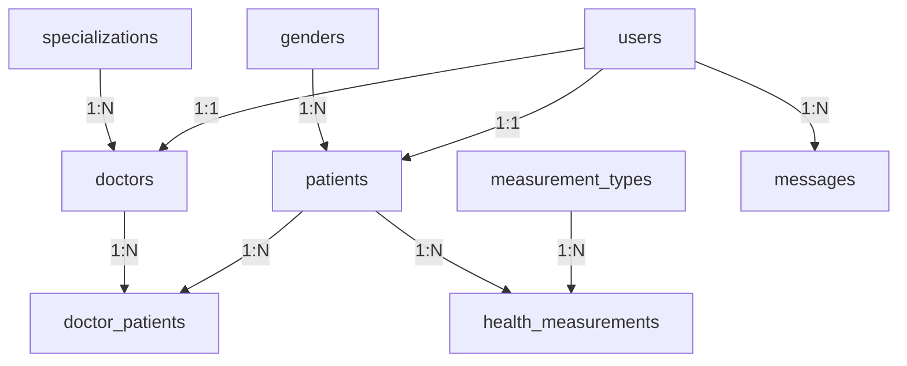

# 🏥 Hastalar Ekranı Supabase Servisleri Dokümantasyonu

Bu dokümantasyon, HealthTracker-Doctors uygulamasının hastalar ekranında kullanılan Supabase servislerini detaylı olarak açıklamaktadır.

## 📋 Genel Bakış

Sistem hastalar yönetimi için **3 ana servis** kullanmaktadır:

1. **DoctorService** - Doktor ve hasta yönetimi
2. **PatientDetailService** - Hasta detayları ve sağlık verileri  
3. **DoctorMeasurementService** - Ölçüm geçmişi ve detayları

---

## 🔧 1. DoctorService (`services/doctorService.ts`)

Bu servis doktor ve hasta yönetiminin temelini oluşturur.

### 📌 Ana Metotlar

#### `getDoctorProfile(userId: string): Promise<DoctorProfile | null>`
- **İşlev:** Kullanıcı ID'si ile doktor profilini getirir
- **Parametreler:** 
  - `userId`: Kullanıcının unique ID'si
- **Döndürür:** DoctorProfile objesi veya null
- **Veri Yapısı:**
  ```typescript
  interface DoctorProfile {
    id: string;
    name: string | null;
    surname: string | null;
    email: string;
    specialization_name: string | null;
    patient_count: number | null;
    created_at: string | null;
  }
  ```
- **Kullanım:** Giriş yapan doktorun bilgilerini almak için

#### `getDoctorById(doctorId: string): Promise<DoctorProfile | null>`
- **İşlev:** Doktor ID'si ile doktor bilgilerini getirir
- **Parametreler:**
  - `doctorId`: Doktorun unique ID'si
- **Döndürür:** DoctorProfile objesi veya null
- **Kullanım:** Belirli bir doktorun bilgilerini almak için

#### `getDoctorPatients(doctorId: string): Promise<DoctorWithPatients['patients']>`
- **İşlev:** Belirli doktora ait tüm hastaları listeler
- **Veritabanı Sorgusu:** 
  ```sql
  SELECT patients.* FROM doctor_patients 
  JOIN patients ON doctor_patients.patient_id = patients.id
  WHERE doctor_patients.doctor_id = ? AND doctor_patients.is_deleted = false
  ```
- **Döndürür:** Hasta listesi
- **Veri Yapısı:**
  ```typescript
  interface Patient {
    id: string;
    name: string | null;
    surname: string | null;
    birth_date: string | null;
    gender_name: string | null;
    patient_note: string | null;
    created_at: string | null;
  }
  ```
- **Kullanım:** Hastalar ekranındaki ana liste için

#### `updateDoctorProfile(doctorId: string, updates: object): Promise<boolean>`
- **İşlev:** Doktor profilini günceller
- **Parametreler:**
  - `doctorId`: Doktorun ID'si
  - `updates`: Güncellenecek alanlar (name, surname, specialization_id)
- **Döndürür:** Başarı durumu (boolean)

#### `getSpecializations(): Promise<Tables<'specializations'>[]>`
- **İşlev:** Tüm uzmanlık alanlarını listeler
- **Döndürür:** Uzmanlık alanları dizisi
- **Kullanım:** Doktor profil güncelleme formunda

#### `updatePatientCount(doctorId: string): Promise<boolean>`
- **İşlev:** Doktorun hasta sayısını otomatik günceller
- **Süreç:**
  1. `doctor_patients` tablosundan hasta sayısını hesaplar
  2. `doctors` tablosundaki `patient_count` alanını günceller
- **Döndürür:** Başarı durumu (boolean)

### 🛠️ Yardımcı Metotlar

#### `calculateAge(birthDate: string): number`
- **İşlev:** Doğum tarihinden yaş hesaplar
- **Algoritma:** Bugünün tarihi ile doğum tarihi arasındaki farkı hesaplar
- **Kullanım:** Hasta kartlarında yaş göstermek için

#### `formatGender(genderName: string | null): string`
- **İşlev:** Cinsiyet bilgisini Türkçe formatlar
- **Dönüşümler:**
  - Male → Erkek
  - Female → Kadın  
  - Other → Diğer
- **Kullanım:** Hasta kartlarında cinsiyet göstermek için

---

## 🔬 2. PatientDetailService (`services/patientDetailService.ts`)

Bu servis hasta detayları ve sağlık verilerini yönetir.

### 📌 Ana Metotlar

#### `getPatientDetail(patientId: string): Promise<PatientDetailData>`
- **İşlev:** Hastanın tüm detaylarını getirir
- **Veri Toplama Süreci:**
  1. **Hasta temel bilgileri** (`patients` tablosu)
  2. **Son mesaj** (`messages` tablosu)  
  3. **Sağlık veri kategorileri** (hesaplanmış)
- **Döndürür:** PatientDetailData objesi
- **Veri Yapısı:**
  ```typescript
  interface PatientDetailData {
    id: string;
    user_id: string | null;
    name: string | null;
    surname: string | null;
    birth_date: string | null;
    gender_name: string | null;
    patient_note: string | null;
    created_at: string | null;
    lastMessage?: {
      id: string;
      content: string;
      created_at: string;
      sender_name: string;
    } | null;
    healthDataCategories: DataCategory[];
  }
  ```

### 🔒 Private Metotlar

#### `getHealthDataCategories(patientId: string): Promise<DataCategory[]>`
- **İşlev:** Hastanın sağlık veri kategorilerini hazırlar
- **Süreç:**
  1. `measurement_types` tablosundan tüm kategorileri alır
  2. Her kategori için en son ölçümü sorgular
  3. Tarih bilgisiyle birlikte formatlar
- **Örnek Kategoriler:**
  - Kan Şekeri (mg/dL)
  - Kan Basıncı (mmHg)
  - Kilo (kg)
  - Boy (cm)
  - Vücut Sıcaklığı (°C)
  - Nabız (bpm)
  - Oksijen Satürasyonu (%)

#### `getIconNameForMeasurementType(code: string): string`
- **İşlev:** Ölçüm türü koduna göre ikon adı döndürür
- **İkon Haritası:**
  ```typescript
  const iconMap = {
    'blood_glucose': 'tint',
    'blood_pressure': 'heart',
    'weight': 'balance-scale',
    'height': 'arrows-v',
    'temperature': 'thermometer-half',
    'pulse': 'heartbeat',
    'oxygen_saturation': 'lungs',
    'cholesterol': 'flask',
    'hemoglobin': 'tint',
    'bmi': 'calculator'
  };
  ```

---

## 📊 3. DoctorMeasurementService (`services/patientDetailService.ts`)

Bu servis ölçüm geçmişi ve detaylarını yönetir.

### 📌 Ana Metotlar

#### `getMeasurementHistory(patientId: string, measurementTypeId: number): Promise<MeasurementRecord[]>`
- **İşlev:** Belirli ölçüm türü için hasta geçmişini getirir
- **Veritabanı Sorgusu:**
  ```sql
  SELECT hm.*, mt.* FROM health_measurements hm
  JOIN measurement_types mt ON hm.measurement_type_id = mt.id
  WHERE hm.patient_id = ? AND hm.measurement_type_id = ? 
  AND hm.is_deleted = false
  ORDER BY hm.measured_at DESC
  ```
- **Sıralama:** En yeniden eskiye doğru
- **Döndürür:** MeasurementRecord dizisi
- **Veri Yapısı:**
  ```typescript
  interface MeasurementRecord {
    id: string;
    value: number;
    measured_at: string;
    method: string | null;
    created_at: string;
    updated_at: string | null;
    measurement_types: {
      id: number;
      name: string;
      unit: string;
      code: string;
    };
  }
  ```
- **Kullanım:** Ölçüm geçmişi sayfası için

#### `getMeasurementDetails(measurementId: string): Promise<MeasurementDetails | null>`
- **İşlev:** Tek bir ölçümün detaylarını getirir
- **Veritabanı Sorgusu:**
  ```sql
  SELECT hm.*, mt.* FROM health_measurements hm
  JOIN measurement_types mt ON hm.measurement_type_id = mt.id
  WHERE hm.id = ? AND hm.is_deleted = false
  ```
- **İçerik:** Değer, tarih, method, ölçüm türü bilgileri
- **Döndürür:** MeasurementDetails objesi
- **Veri Yapısı:**
  ```typescript
  interface MeasurementDetails extends MeasurementRecord {
    patient_id: string;
  }
  ```
- **Kullanım:** Ölçüm detay sayfası için

---

## 🗃️ Veritabanı Tabloları

### 📋 Ana Tablolar

| Tablo | Açıklama | Ana Alanlar |
|-------|----------|-------------|
| `doctors` | Doktor bilgileri | id, name, surname, user_id, specialization_id, patient_count |
| `patients` | Hasta bilgileri | id, name, surname, birth_date, gender_id, user_id, patient_note |
| `doctor_patients` | Doktor-hasta ilişkisi | doctor_id, patient_id, is_deleted |
| `health_measurements` | Sağlık ölçümleri | id, patient_id, measurement_type_id, value, measured_at, method |
| `measurement_types` | Ölçüm türleri | id, name, unit, code |
| `messages` | Mesajlar | id, sender_user_id, receiver_user_id, content, created_at |
| `genders` | Cinsiyet referansı | id, name |
| `specializations` | Uzmanlık alanları | id, name |

### 🔗 İlişkiler



### 🔄 Veri Akışı

1. **Hastalar Ekranı Yükleme:**
   ```typescript
   const patients = await doctorService.getDoctorPatients(doctorId);
   ```

2. **Hasta Detayı Görüntüleme:**
   ```typescript
   const patientDetail = await patientDetailService.getPatientDetail(patientId);
   ```

3. **Ölçüm Geçmişi Görüntüleme:**
   ```typescript
   const history = await doctorMeasurementService.getMeasurementHistory(
     patientId, 
     measurementTypeId
   );
   ```

4. **Ölçüm Detayı Görüntüleme:**
   ```typescript
   const detail = await doctorMeasurementService.getMeasurementDetails(measurementId);
   ```

---

## 🚀 Kullanım Örnekleri

### Hasta Listesi Getirme
```typescript
import { doctorService } from '~/services/doctorService';

const loadPatients = async (doctorId: string) => {
  try {
    const patients = await doctorService.getDoctorPatients(doctorId);
    console.log(`${patients.length} hasta bulundu`);
    return patients;
  } catch (error) {
    console.error('Hasta listesi yüklenemedi:', error);
    return [];
  }
};
```

### Hasta Detayı Getirme
```typescript
import { patientDetailService } from '~/services/patientDetailService';

const loadPatientDetail = async (patientId: string) => {
  try {
    const detail = await patientDetailService.getPatientDetail(patientId);
    console.log(`Hasta: ${detail.name} ${detail.surname}`);
    console.log(`Sağlık kategorileri: ${detail.healthDataCategories.length}`);
    return detail;
  } catch (error) {
    console.error('Hasta detayı yüklenemedi:', error);
    throw error;
  }
};
```

### Ölçüm Geçmişi Getirme
```typescript
import { doctorMeasurementService } from '~/services/patientDetailService';

const loadMeasurementHistory = async (patientId: string, typeId: number) => {
  try {
    const history = await doctorMeasurementService.getMeasurementHistory(
      patientId, 
      typeId
    );
    console.log(`${history.length} ölçüm kaydı bulundu`);
    return history;
  } catch (error) {
    console.error('Ölçüm geçmişi yüklenemedi:', error);
    return [];
  }
};
```

---

## ⚠️ Hata Yönetimi

Tüm servisler kapsamlı hata yönetimi içerir:

- **Console Logging:** Detaylı hata logları
- **Error Throwing:** Üst katmana hata iletimi
- **Graceful Degradation:** Hata durumunda boş diziler/null döndürme
- **Validation:** Veri bütünlüğü kontrolleri

### Örnek Hata Yönetimi
```typescript
try {
  const result = await someService.getData();
  return result;
} catch (error) {
  console.error('💥 [ServiceName] Hata oluştu:', error);
  throw error instanceof Error ? error : new Error('Beklenmeyen hata');
}
```

---

## 📝 Notlar

- Tüm servisler singleton pattern kullanır
- Veritabanı sorguları otomatik olarak `is_deleted = false` filtresi uygular
- Tarih formatları ISO 8601 standardında
- Yaş hesaplaması Türkiye saat diliminde
- Cinsiyet formatlaması Türkçe dil desteği ile

---

**Son güncelleme:** 26 Mayıs 2025  
**Versiyon:** 1.0  
**Proje:** HealthTracker-Doctors
